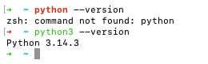
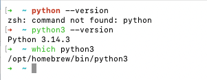
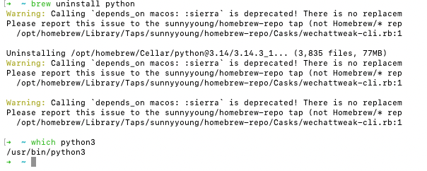

# Python 环境（上）：卸载环境

> 先卸载电脑本地python，删干净防止后续麻烦

### 如何清理 Mac 上的 Python 环境

如果你不确定 Python 是如何安装到你的 Mac 上的，并且想彻底清理 Python 环境，可以按以下步骤操作。我们会逐步排查并删除不同类型的 Python 环境。

#### 1. 检查 Python 安装方式

在开始清理之前，我们需要确认 Python 是通过哪种方式安装的，常见的安装方式包括系统自带、Homebrew、Anaconda/Miniconda、或者通过安装包。

### 1.1. 检查系统自带的 Python

macOS 自带了 Python 2.x 和 3.x，通常这些是系统必需的，删除它们可能会影响系统功能。如果你是想清理自己手动安装的 Python 版本，可以跳过这些步骤。

1. 打开 **终端**（Terminal）并运行以下命令来查看 Python 的版本：

   ```bash
   python --version
   python3 --version
   ```

   - 如果返回的是 `/usr/bin/python`​ 或 `/usr/bin/python3`，那么这是系统自带的 Python，不能删除。
   - 

### 1.2. 检查是否通过 Homebrew 安装 Python

如果你通过 Homebrew 安装了 Python，可以通过以下命令检查：

```
which python3
```

- 如果路径是 `/opt/homebrew/bin/python3`，那么就是通过 Homebrew 安装的。
- 

那么接下来使用 Homebrew 来卸载 Python：

```
brew uninstall python
```

卸载完成后 我们在看看是否删除



### 1.3. 检查是否安装了 Anaconda 或 Miniconda

如果你使用了 **Anaconda** 或 **Miniconda**，可以通过以下命令检查：

```
which conda
```

如果返回的是类似 `/opt/homebrew/bin/conda` 的路径，那么说明你安装了 Conda。

卸载 Conda 相关环境：

- 使用 `conda` 卸载：

  ```
  conda remove --name <environment_name> --all
  ```
- 完全卸载 Anaconda 或 Miniconda：

  ```
  rm -rf ~/anaconda3
  rm -rf ~/.conda
  ```

### 1.4. 检查通过 `pyenv` 安装的 Python

如果你使用了 **pyenv** 来管理多个 Python 版本，可以通过以下命令检查：

```
pyenv versions
```

- 如果安装了 Python 版本，可以使用以下命令删除：

  ```
  pyenv uninstall <version>
  ```

## 2. 彻底删除 Python 环境

根据安装方式，以下是删除 Python 环境的具体操作。

### 2.1. 删除通过 Homebrew 安装的 Python

- 首先，使用以下命令删除 Python：

  ```
  brew uninstall python
  ```
- 如果需要清理 Homebrew 缓存：

  ```
  brew cleanup
  ```

### 2.2. 删除通过 Anaconda/Miniconda 安装的 Python

如果你安装了 **Anaconda** 或 **Miniconda**，可以通过以下命令删除：

1. 删除 `Anaconda`​ 或 `Miniconda`：

   ```
   rm -rf ~/anaconda3
   rm -rf ~/.anaconda
   rm -rf ~/.conda
   ```
2. 删除 Conda 环境：

   ```
   conda remove --name <environment_name> --all
   ```

### 2.3. 删除 `pyenv` 安装的 Python 版本

如果你使用 `pyenv`，你可以删除它管理的 Python 版本：

```
pyenv uninstall <version>
```

### 2.4. 清理虚拟环境

如果你在使用 **virtualenv** 或 **venv** 创建虚拟环境，可以删除相关文件夹：

- 删除虚拟环境文件夹：

  ```
  rm -rf /path/to/your/venv
  ```

### 2.5. 清理环境变量和配置

如果你在 `.bash_profile`​ 或 `.zshrc` 中设置了 Python 环境变量，记得删除相关内容：

1. 打开 `.zshrc`​ 或 `.bash_profile` 文件：

   ```
   nano ~/.zshrc  # 如果使用 Zsh
   nano ~/.bash_profile  # 如果使用 Bash
   ```
2. 查找并删除类似下面的行（可能设置了 PYTHON 路径或其他环境变量）：

   ```
   export PATH="/path/to/python:$PATH"
   ```
3. 保存并退出，使用以下命令使改动生效：

   ```
   source ~/.zshrc  # 如果使用 Zsh
   source ~/.bash_profile  # 如果使用 Bash
   ```

## 3. 重启并检查

完成上述操作后，建议重启电脑或者重新启动终端应用，确保配置生效。

然后，你可以通过以下命令检查 Python 是否成功卸载：

```
python --version
python3 --version
```

如果显示 "command not found"，说明 Python 已经完全卸载。
