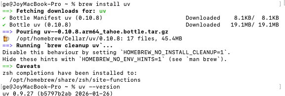
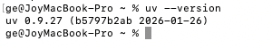
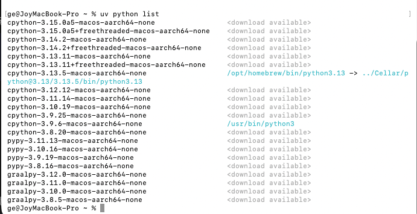
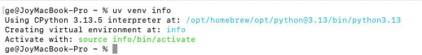
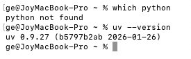
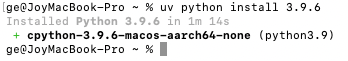
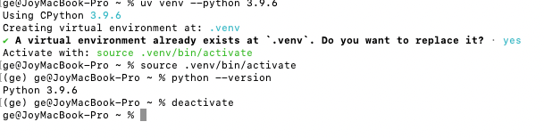

# Python 环境（下）：通过 uv 管理 Python 环境

> **UV** 可以简单理解为前端开发中常用的工具 **Node Version Manager (nvm)** ，它是一个环境和版本切换工具，类似于 `nvm`​ 在 Node.js 生态中的作用。除了 `nvm`​，在 Python 中也有类似功能的工具，如 **Conda** 和 **pyenv**。不过，UV 并不仅仅是一个版本切换工具，它具有更广泛的功能。

### 1. uv是什么

UV 不仅仅是一个 \*\*切换环境 / 版本\*\* 的工具，它是一个 \*\*一站式的 Python 包管理 + 环境管理器\*\*，综合了以下功能：

1. \*\*环境和版本切换\*\*：类似于 \`nvm\`，你可以轻松切换不同的 Python 版本和环境。
2. \*\*包管理\*\*：集成了 \*\*pip\*\*，用于安装、管理和更新 Python 包。
3. \*\*虚拟环境管理\*\*：集成了 \*\*venv\*\*，允许你为每个项目创建和管理独立的 Python 环境，避免版本冲突。
4. \*\*一站式管理\*\*：你不再需要在不同的工具之间切换，UV 结合了这些功能，使得 Python 的环境和包管理更加简洁和高效。

### 2. 如何下载 UV

1. 打开 **终端**（Terminal）并运行以下命令来安装 UV：

   ```
   brew install uv
   ```

   
2. 安装完成后，检查 **UV** 版本以确保安装成功：

   ```
   uv --version
   ```



## 3. 如何使用 UV

### 3.1 查看已安装的环境列表

你可以使用以下命令查看当前可用的环境和版本列表：

```
uv python list
```



查看当前项目的虚拟环境信息（路径、Python 版本）

```
uv venv info
```



查看当前终端使用的 Python/uv 环境（辅助验证）

```
which python  # 看 Python 路径
uv --version  # 看 uv 版本
```



### 3.2 下载和安装新的环境

通过 UV 你可以方便地下载并安装新的 Python 环境，以下命令会下载并安装指定版本的 Python：

```
# 下载并安装 Python 3.9.6
uv python install 3.9.6

# 可选：安装最新的 3.9 系列版本
uv python install 3.9
```



### 3.3 切换环境

uv 不是通过 `uv use`​ 这种 “全局切换”，而是**通过「虚拟环境」隔离版本**（更符合 Python 最佳实践）

```
# 1. 基于指定版本创建虚拟环境（核心：用哪个版本就建哪个环境）
uv venv --python 3.9.6  # 会在当前目录生成 .venv 文件夹

# 2. 激活该环境（等同于“切换”到 3.9.6 环境）
source .venv/bin/activate  # Linux/Mac
.venv\Scripts\Activate.ps1 # Windows

# 3. 验证是否切换成功
python --version  # 输出 Python 3.9.6 即成功

# 4. 退出环境（取消切换）
deactivate
```



### 3.4 替代 `pip` 使用

uv是替代 `pip`​ 进行包管理。但要注意：**需在激活虚拟环境后使用**，避免污染全局环境：

```
# 先激活虚拟环境（关键前提）
source .venv/bin/activate

# 1. 安装包（正确，和你贴的一致）
uv install requests  # 等价于 pip install requests

# 2. 更新包（正确）
uv update requests

# 3. 删除包（正确）
uv uninstall requests

# 4. 额外补充：安装指定版本包
uv install requests==2.31.0

# 5. 导出依赖（替代 pip freeze）
uv pip freeze > requirements.txt
```

UV 是一个强大的 Python 环境和包管理工具，不仅提供类似 `nvm`​ 的版本切换功能，还集成了 `pip`​ 和 `venv` 的功能，帮助开发者更轻松地管理项目的环境和依赖包。

‍
