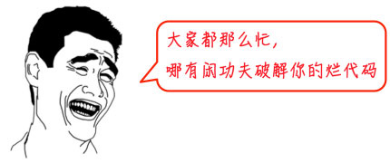

# Python 简介与历史

> 可以跳过，简单了解一下

### 1. 简介

**Python** 是一种高级的、通用的计算机程序设计语言，旨在提供易读、易学的编程体验。

> 编程语言来开发任何程序都是为了让计算机干活完成特定任务（如下载文件、处理数据等），而计算机干活的 CPU 只认识机器指令（二进制（即 0 和 1）），不同的编程语言差异极大，最后得到的都是“翻译”成 CPU 可以执行的机器指令。不同的编程语言，干同一个活，编写的代码量，差距也很大。

它由 **Guido van Rossum** 于 1989 年开发，并于 1991 年首次发布。Python 强调 **代码可读性** 和 **简洁性**，使得程序员可以用更少的代码编写出清晰且功能强大的程序。

> 比如，完成同一个任务，C 语言要写 1000 行代码，Java 只需要写 100 行，而 Python 可能只要 20 行。

那么问题来了，代码少还不好？

> 代码少的代价是运行速度慢，C 程序运行 1 秒钟，Java 程序可能需要 2 秒，而 Python 程序可能就需要 10 秒。

### 2. 历史

- Python 是著名的“龟叔”Guido van Rossum 在 1989 年圣诞节期间，为了打发无聊的圣诞节而编写的一个编程语言。
- 在 1991 年，发布了 Python 的第一个版本（Python 0.9.0）。

### 3. Python 优点

- **简单优雅**：能够用更少的代码做更多的事情，提升开发效率。
- **开放源代码**：拥有强大的社区和生态圈，众多优秀的第三方库和工具。
- **跨平台**：Python 是解释型语言，能够在多种操作系统上运行，开发者可以在不同平台间轻松迁移。

### 4. Python 缺点

1. **运行速度慢**：由于 Python 是解释型语言，代码在执行时会一行一行地翻译成 CPU 能理解的机器码，这个翻译过程非常耗时，而 C 程序在运行前直接编译成 CPU 能执行的机器码。

   > 但是大量的应用程序不需要这么快的运行速度，因为用户根本感觉不出来。例如开发一个下载 MP3 的网络应用程序，C 程序的运行时间需要 0.001 秒，而 Python 程序的运行时间需要 0.1 秒，慢了 100 倍，但由于网络更慢，需要等待 1 秒，你想，用户能感觉到 1.001 秒和 1.1 秒的区别吗？这就好比 F1 赛车和普通的出租车在北京三环路上行驶的道理一样，虽然 F1 赛车理论时速高达 400 公里，但由于三环路堵车的时速只有 20 公里，因此，作为乘客，你感觉的时速永远是 20 公里。

   

2. **代码不能加密**：由于 Python 是解释型语言，代码在运行时需要被翻译成机器码，这个过程是公开的，任何人都可以查看和修改 Python 代码，而 C 程序在编译后生成的机器码是不可读的，无法直接查看和修改。

   > 这个缺点仅限于你要编写的软件需要卖给别人挣钱的时候。好消息是目前的互联网时代，靠卖软件授权的商业模式越来越少了，靠网站和移动应用卖服务的模式越来越多了，后一种模式不需要把源码给别人。

   > 再说了，现在如火如荼的开源运动和互联网自由开放的精神是一致的，互联网上有无数非常优秀的像 Linux 一样的开源代码，我们千万不要高估自己写的代码真的有非常大的“商业价值”。那些大公司的代码不愿意开放的更重要的原因是代码写得太烂了，一旦开源，就没人敢用他们的产品了。

   
