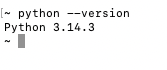

# 第一个 Python 程序

> 作为前端开发第一次写 Python 代码，写第一个 Python 程序之前，我们学习一下什么是命令行模式和 Python 交互模式。

### 命令行模式

在 macOS 中，打开终端，进入命令行模式。我们输入 `python3` 命令便进入 Python 交互模式，也可以输入 `python3 hello.py` 来运行一个 `.py` 文件。

**执行 .py 文件：**

```bash
$ cd /4.第一个Python程序/hello.py
$ python3 hello.py
Hello, world!
```


### Python 交互模式

在命令行模式下输入 `python3`，进入 Python 交互模式（提示符 `>>>`）。交互模式会自动打印每行代码的结果：

```python
>>> print("Hello, Python!")
Hello, Python!
>>> 100 + 200
300
>>> exit()  # 退出交互模式
```

**字符串拼接 - 前端 vs Python：**

在前端 JavaScript 中，我们使用模版字符串：

```javascript
// JavaScript
const name = "张三";
const age = 18;
console.log(`我叫${name}，今年${age}岁`);
```

在 Python 中，有三种方式实现类似效果：

```python
# Python - f-string（推荐，类似 JS 模版字符串）
>>> name = "张三"
>>> age = 18
>>> print(f"我叫{name}，今年{age}岁")
我叫张三，今年18岁

# Python - format 方法
>>> print("我叫{}，今年{}岁".format(name, age))
我叫张三，今年18岁

# Python - % 格式化（旧式）
>>> print("我叫%s，今年%d岁" % (name, age))
我叫张三，今年18岁
```

**交互模式 vs 文件执行：**

交互模式自动打印结果，但 `.py` 文件需要显式使用 `print()`：

```python
# calc.py
100 + 200  # 不会输出
print(100 + 200)  # 输出 300
```

```bash
$ python3 calc.py
300
```

## 常见错误

### 1. `SyntaxError` 是什么？

如果遇到 `SyntaxError`，表示 Python 在“读取代码”这一步就发现语法不对，代码还没开始真正执行。

最常见的原因有：

- 使用了中文标点
- 括号没有成对出现
- 引号没有成对出现
- 漏写冒号 `:`
- 代码缩进不正确

例如下面这段代码：

```python
>>> print（'hello'）
  File "<stdin>", line 1
    print（'hello'）
         ^
SyntaxError: invalid character '（' (U+FF08)
```

这里的错误不是 `print` 有问题，而是 `(` 写成了中文括号 `（`。

报错信息里的：

- `invalid character` 表示出现了无效字符
- `'（'` 表示具体出错的字符是中文左括号
- `^` 表示 Python 发现问题的大概位置

### 2. 使用了中文括号

中文输入法下，很容易把英文括号 `()` 打成中文括号 `（）`。

```python
>>> print（'hello'）  # 错误：中文括号（）
  File "<stdin>", line 1
    print（'hello'）
         ^
SyntaxError: invalid character '（' (U+FF08)
```

正确写法：

```python
>>> print('hello')
hello
```

### 3. 使用了中文引号

中文输入法下，也很容易把英文引号 `'` 或 `"` 打成中文引号 `‘’` 或 `“”`。

错误示例：

```python
>>> print(“hello”)
  File "<stdin>", line 1
    print(“hello”)
          ^
SyntaxError: invalid character '“' (U+201C)
```

或者：

```python
>>> print(‘hello’)
  File "<stdin>", line 1
    print(‘hello’)
          ^
SyntaxError: invalid character '‘' (U+2018)
```

正确写法：

```python
>>> print("hello")
hello
>>> print('hello')
hello
```

### 4. 怎么解决 `SyntaxError`？

可以按下面的顺序检查：

**第一步：先看报错最后一行**

比如：

```python
SyntaxError: invalid character '（' (U+FF08)
```

这说明有“非法字符”，通常就是中文符号。

**第二步：看 `^` 指向的位置**

`^` 一般会告诉你错误大概出现在什么地方。

```python
>>> print（'hello'）
         ^
```

这里就说明问题出在 `print` 后面的括号位置。

**第三步：检查是不是中文输入法输入的符号**

重点检查这些字符：

- 中文括号 `（ ）`
- 中文引号 `“ ”`、`‘ ’`
- 中文逗号 `，`
- 中文冒号 `：`
- 中文分号 `；`

Python 代码里应该尽量使用英文符号：

- 英文括号 `()`
- 英文引号 `""` 或 `''`
- 英文逗号 `,`
- 英文冒号 `:`

### 5. 其他常见的 `SyntaxError`

**（1）漏写冒号 `:`**

```python
>>> if 1 > 0
  File "<stdin>", line 1
    if 1 > 0
            ^
SyntaxError: expected ':'
```

正确写法：

```python
>>> if 1 > 0:
...     print("yes")
...
yes
```

**（2）括号没有写完整**

```python
>>> print("hello"
  File "<stdin>", line 1
    print("hello"
         ^
SyntaxError: '(' was never closed
```

正确写法：

```python
>>> print("hello")
hello
```

**（3）字符串引号没有闭合**

```python
>>> print("hello)
  File "<stdin>", line 1
    print("hello)
          ^
SyntaxError: unterminated string literal
```

正确写法：

```python
>>> print("hello")
hello
```

**（4）缩进不正确**

```python
>>> if 1 > 0:
... print("yes")
  File "<stdin>", line 2
    print("yes")
    ^
IndentationError: expected an indented block
```

正确写法：

```python
>>> if 1 > 0:
...     print("yes")
...
yes
```

## 为什么用 `python3` 而不是 `python`？

> 这里演示的是 mac ，并且注意区分 macOS 上的 Zsh 和 Bash 配置文件`echo $SHELL`

如果你想让 `python` 命令直接指向 **Python 3**，可以通过以下方法进行设置。

#### 1. 打开终端并使用 `alias` 设置临时别名：

在你的 **终端** 中输入以下命令，创建一个别名，使 `python` 指向 `python3`：

```bash
# 为Zsh shell 创建一个 别名，将 python 命令指向 python3。
echo 'alias python="python3"' >> ~/.zshrc
```

#### 2. 重新加载配置文件使别名生效：

执行以下命令，重新加载 **zsh** 配置文件，使刚才设置的别名生效：

```bash
source ~/.zshrc
```

#### 3. 验证设置：

输入以下命令，检查 `python` 是否已经指向 Python 3：

```bash
python --version  # 输出应为 Python 3 的版本
```


