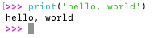
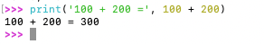
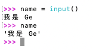

# 输入与输出

## 输出（Output）

### `print()` 函数基础

- 使用 `print()` 可以向屏幕输出内容，

```python
print('hello, world')   # 输出字符串
```



- `print()` 可以接受 **多个参数**，用逗号 `,` 分隔，会自动在参数间插入空格；

```python
print('100 + 200 =', 100 + 200)  # 自动拼接输出
# 输出: 100 + 200 = 300
```



- `print()` 也可以打印整数，表达式的计算结果等；

```python
print(300)           # 输出: 300
print(100 + 200)     # 输出: 300
```

---

## 输入（Input）

### `input()` 函数基础

- Python 提供 `input()` 函数获取用户输入内容，输入的结果会作为 **字符串** 返回并存放到变量中；

```python
name = input()
```

- 如果想要在输入前给用户一个提示，可以把提示字符串作为参数传入 `input()`；

```python
name = input('Please enter your name: ')
```


**注意**：用户输入后的内容无论是什么类型，`input()` 都会返回一个字符串。

---

## 3. 结合输入和输出 — 示例

下面示例展示了一个简单的交互式程序：

```python
name = input('Please enter your name: ')
print('hello,', name)
```

程序执行逻辑：

1. 提示用户输入名字
2. 用户输入完成后回车
3. 输出 `hello, 用户名字` 的欢迎语；

---

## 4. 变量

- 输入保存到变量后，可以在程序中重复使用该变量；
- 变量能存放不同类型的数据，例如字符串、整数等；

```python
name = input()
print(name)
```

---
