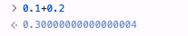
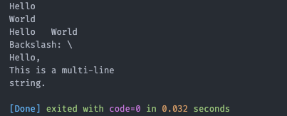

# 数据类型和变量

## 数据类型

### 整数

Python 支持任意大小的整数，包括负整数。整数可以直接写如：`1`、`100`、`-8080`、`0` 等。当你看到数字使用 `0-9` 和 `a-f`不要震惊，这是十六进制整数。

> 例如 `0x1234` 表示十六进制的 `1234`，即十进制的 `4660`。Python 还支持八进制和二进制整数，分别以 `0o` 和 `0b` 开头，例如 `0o123` 表示八进制的 `123`，即十进制的 `83`，`0b1011` 表示二进制的 `1011`，即十进制的 `11`。

### 浮点数

浮点数就是小数，支持科学记数法，例如 `1.23e9` 表示 `1.23 × 10^9`，`1.2e-5` 表示 `0.000012`。

> 浮点数和整数内部不同存储,比如经典的 0.1+0.2！=0.3



### 字符串

字符串是由单引号 `'` 或双引号 `"` 包围的文本。


### 布尔值

布尔值只有两个值：`True` 和 `False`，逻辑运算和条件判断才会使用。

- and：如果两个条件都为 True，结果才为 True。否则为 False。
- or：如果两个条件中至少有一个为 True，结果就是 True。只有两个条件都为 False 时，结果才是 False。
- not：not 操作符用于反转布尔值。

  > 0、 空值 被视为 False，1 被视为 True。

### 空值

空值由 `None` 表示，表示“没有值”或“空”。

## 变量

Python 中的变量不需要事先声明类型，只需要通过赋值操作就能创建变量。赋值时， 会自动根据赋值的内容推断变量的类型,这跟 js 很像。

```
a = 1
t_007 = 'T007'
Answer = True
```

变量名由大小写字母、数字和下划线组成，并且不能以数字开头。变量指向数据对象，赋值只是将变量名和对象关联起来。一个变量也可以指向不同类型的对象，例如：

```
a = 123
a = 'ABC'
```

Python 是动态类型语言，变量本身不固定类型，可以随时更改所指向的对象类型。

## 常量

在程序运行过程中值不会改变的变量,比如常用的数学常数 π 就是一个常量。 Python 没有内置的常量类型，但可以通过命名约定来约定表示常量，例如使用全大写字母来命名常量：`PI`

### 动态语言特性

> 把 Python 想象成 JavaScript， 自动会帮我们声明变量，类型自动推导。

赋值语句中的 等号 = 并不是数学中的“等于”符号，它的作用是 将右侧的值赋给左侧的变量，这意味着左侧的变量将指向右侧表达式的计算结果。

```python
# 赋值语句
a = 10    # a 指向整数 10
b = a     # b 现在指向 a 指向的对象，即整数 10

print(a)  # 输出 10
print(b)  # 输出 10

b = 20    # 现在 b 指向新的对象 20
print(a)  # 输出 10 (a 依然指向 10)
print(b)  # 输出 20 (b 现在指向 20)
```
